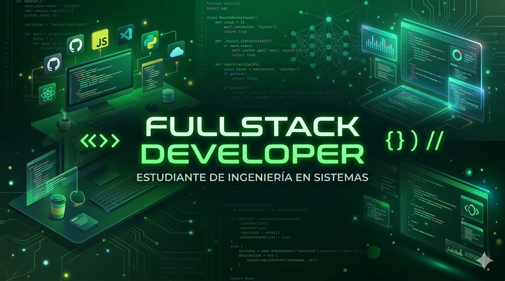

<h1 align="center"> 👋 Hola, soy Nahuel Vailati 👋 </h1>

💻 **Backend Developer | Java | PostgreSQL | Spring Boot**
🎓 Estudiante de **Ingeniería en Sistemas**
🚀 Apasionado por el desarrollo de software, la innovación tecnológica y la resolución de problemas.

## 👨‍💻 Sobre mí

Soy desarrollador backend con conocimientos en **Java, bases de datos relacionales y desarrollo web**.
Me especializo en construir aplicaciones con **arquitectura clara, código mantenible y soluciones eficientes**.

Actualmente me encuentro desarrollando proyectos personales enfocados en:

* Desarrollo **Backend con Java**
* APIs y servicios web
* Modelado y consultas avanzadas en **PostgreSQL**
* Integración entre **frontend y backend**
* Buenas prácticas de desarrollo

Me caracterizo por ser una persona **comprometida, autodidacta y orientada a la mejora continua**.

---

# 🚀 Tecnologías

### Lenguajes

* Java
* Python
* JavaScript
* SQL
* HTML
* CSS
* C++
  

### Backend

* Spring Boot
* APIs REST
* Programación Orientada a Objetos

### Base de Datos

* PostgreSQL
* PL/pgSQL
* Modelado relacional
* Optimización de consultas

### Herramientas

* Git
* GitHub
* IntelliJ IDEA
* DataGrip
* MongoDB Compass

---

# 📂 Proyectos Destacados

### 🛍 Sistema de Gestión para Regalería

Aplicación web para administrar ventas y productos.

**Características:**

* Gestión de productos
* Registro de ventas
* Conexión con base de datos PostgreSQL
* Interfaz web HTML/CSS
* Backend en Java

Tecnologías utilizadas:

Java • PostgreSQL • HTML • CSS • JavaScript

---

### 🧾 Sistema de Comprobantes

Sistema de gestión de comprobantes comerciales.

**Características:**

* Manejo de Facturas, Recibos y Remitos
* Modelo de datos relacional
* Consultas SQL complejas
* Lógica en PL/pgSQL

Tecnologías utilizadas:

PostgreSQL • SQL • PL/pgSQL

---

### 📊 Análisis de datos de servicios

Proyecto enfocado en consultas avanzadas y funciones en PostgreSQL.

**Características:**

* Funciones almacenadas
* Cálculo de promedios y máximos
* Manejo de rangos de fechas
* Optimización de consultas

Tecnologías utilizadas:

PostgreSQL • SQL • PL/pgSQL

---

# 📈 Actualmente aprendiendo

* Arquitectura de software
* Calidad de software
* Ciberseguridad
* Buenas prácticas en backend
* Lenguajes y paradigmas
* Teoria de la informacion
* Sistemas operativos
* Redes
* APIs REST avanzadas
* Optimización de bases de datos

---

# 📫 Contacto

💼 LinkedIn https://www.linkedin.com/in/nahuel-vailati-706a27226
📧 Email profesional Nahuelvailati@gmail.com

---

⭐ Siempre abierto a colaborar en proyectos y nuevas oportunidades.
